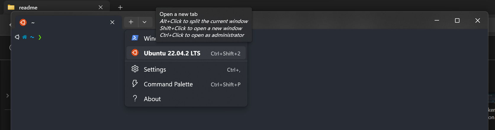
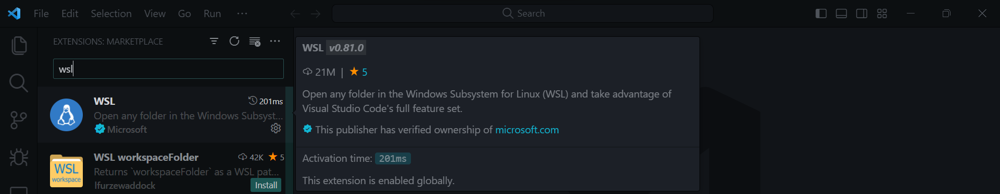
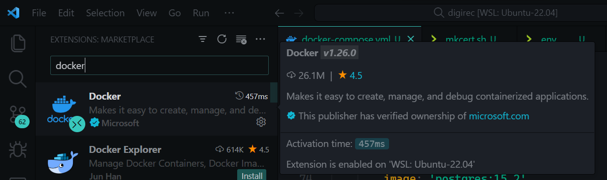
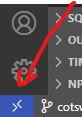

# Step 1 — Install WSL 2
WSL2 (Windows Subsystem for Linux version 2) is a new version of the architecture that allows you to use Linux on top of Windows 10 natively (using a lightweight virtual machine) and replaces WSL.

The feature runs an actual Linux kernel in this new version, which improves performance and app compatibility over the previous version while maintaining the same experience as the first release.

To install WSL 2 on Windows 10 you need:

Windows 10 May 2020 (2004), Windows 10 May 2019 (1903), or Windows 10 November 2019 (1909) or later
A computer with Hyper-V Virtualization support
If you are using Windows 10, the first requirement is not necessary (lol)
To install Windows Subsystem for Linux on Windows 10, use these steps:

Open Start on Windows 10.
Search for Command Prompt or Windows Powershell, right-click the top result, and select the Run as administrator option.
Type the following command to install the WSL on your Windows machine and press Enter:
```sh
wsl --install
```
Restart your computer to finish the WSL installation.
The above command will install all the WSL 2 components and the Ubuntu Linux distribution.

To install a specific Linux distribution, run:
```sh
wsl –install -d DISTRO-NAME.
```

To update the WSL2 kernel, run the command below:
```sh
wsl –update
```

For more details about WSL2 installation, kindly read the documentation.

# Step 2 — Download & Install Docker
To start using docker desktop, first you need to download the docker file for windows.
Your docker downloaded file can be found in your download folder.

Run the set up as Administrator.

Follow the Install Wizard: accept the license, authorize the installer, and proceed with the install.
Click on the Close button once the installation process is finished.
Ensure that your docker user account and administrator account should be the same, otherwise you need to add your user account to the docker user group.
After following all these steps, restart your computer to update and start docker desktop on your windows machine.
To ensure that WSL 2 is running on your docker desktop app:

Start Docker Desktop from the Windows Start menu.
From the Docker menu, select Settings > General.

Select the Use WSL 2 based engine check box. (If you have installed Docker Desktop on a system that supports WSL 2, this option will be enabled by default.)
Click Apply & Restart.
That’s it! Now docker commands will work from Windows using the new WSL 2 engine.

# Step 3 — Grab the latest Laravel release
Now that we have installed Docker Desktop successfully and Windows Subsystem for Linux 2 (WSL2) is installed and enabled, the next step is to create our first Laravel project.

Open your Windows Terminal as Administrator.
Head over to the location where your Laravel project is stored.
Initialize WSL in that location by running the following command:
```sh
wsl
```


# Step 4— Starting the services
Laravel Sail provides a simple command-line interface for interacting with Laravel’s default Docker configuration.

After the project has been created, you can navigate to the application directory and start Laravel Sail.

```sh
cd example-app
 ```
```sh
./vendor/bin/sail up
```

# Once the application’s Docker containers have been started, you can access the application in your web browser at: http://localhost.

>**NOTE**
>By default, Sail commands are invoked using the vendor/bin/sail script that is included with all new Laravel applications. However, instead of repeatedly >typing vendor/bin/sail to execute Sail commands, you may wish to configure a shell alias that allows you to execute Sail's commands more easily:
>```sh
>alias sail='[ -f sail ] && sh sail || sh vendor/bin/sail'
>```

>**NOTE**
>Once the shell alias has been configured, you may execute Sail commands by simply typing sail. The remainder of this documentation's examples will assume >that you have configured this alias:
>```sh
>sail up
>```

Before starting Sail, you should ensure that no other web servers or databases are running on your local computer. To start all of the Docker containers defined in your application’s docker-compose.yml file, you should execute the up command:
```sh
sail up
```

To start all of the Docker containers in the background, you may start Sail in “detached” mode:
```sh
sail up -d
```

To stop all of the containers, you may simply press Control + C to stop the container’s execution. Or, if the containers are running in the background, you may use the stop command:
```sh
sail stop
```

To continue learning more about Laravel Sail, review its complete documentation.

# Reading on git cli and linux shell commands
Here are a few articles explaining the basics for git and linux, which will come in handy when working with WSL:

1. [Git tutorial for beginners](https://linuxconfig.org/git-tutorial-for-beginners)
2. [Command line for beginners](https://ubuntu.com/tutorials/command-line-for-beginners#1-overview)
3. [Docker and Docker Compose commands cheatsheet](https://aws.plainenglish.io/the-ultimate-cheat-sheet-for-basic-docker-and-git-docker-compose-6e08e3f861da)


# Configuring the local environment (Windows + WSL)

## Install and configure WSL, Ubuntu
Before anything else, the environment requires WSL and Ubuntu to be installed on Windows, as seen in [this article](https://ubuntu.com/tutorials/install-ubuntu-on-wsl2-on-windows-11-with-gui-support#1-overview) *
After installation, a new shell profile will be added in Windows Terminal. It is recommended to use this from now on, as it is the most feature-rich of all options.

>**NOTE:**
>
>When installing Ubuntu, you will be prompted for a username and password. Remember this password, as it will be needed later.

>**NOTE:**
>
> From this point forward, all command line commands/scripts will be run in a new Ubuntu terminal(not powershell, or git bash, or cmd). In order to use it, open a Microsoft Terminal instance, click on the down arrow next to the new tab button, and select the Ubuntu profile, as shown below.


## Install docker desktop
1. Download Docker Desktop ( https://docs.docker.com/get-docker/ )
2. Install Docker Desktop


## Configure Visual Studio Code
Before we run the project, we need to configure VS Code to be able to work with WSL and Docker. For this, we need to install extensions for the two, as seen below:





## Run VS Code in WSL
You need first to connect to WSL with VS Code. Go at the bottom left of the window and click on this button  then select Connect to WSL in a New Window. Now you are running VS Code in Ubuntu, you need to open the project from Ubuntu, not from your regular Windows folders. From here on, each terminal window you open will be in WSL.

# Running the project

Run the initialization script to clean the project folder and build the docker images:
```sh
sudo ./scripts/init.sh
```

This command will require the password created in the beginning. It will do the following:
 - Copy `.env.example` to `.env`
 - Build the docker images. When the images are started, they will automatically install the latest dependencies for php (`composer install`) 


After this, we can start running the project. Make sure Docker Desktop is running and **that there are no other containers running using the same port 80. Turn them off if that's the case**, then run the start script:

```sh
./scripts/start.sh
```

This will run the docker-compose command which will pull the images and build the containers.

> **Note**
>
> In order to stop the containers, we need to run the following command:
>
>`./scripts/stop.sh`
>
> Or if something went wrong and some errors were produced, you could restart the process with:
> 
>`./scripts/restart.sh`

Run yarn to install all dependencies:
`./scripts/yarn.sh install`

Only when setting up the project for the first time:
`php artisan migrate`
`php artisan db:seed`
`php aartisan key:generate`


In a terminal window (opened in Ubuntu as instructed earlier), navigate to the project's folder (and, if needed, switch to your desired branch):

```sh
sudo mount -t drvfs <drive_letter>:/ /mnt/<mount_point>
```

Replace <drive_letter> with the drive letter of the Windows folder that you want to mount and <mount_point> with the mount point that you created in step 3.

For example, to mount the Windows folder C:\Users\John Doe\Desktop to the mount point /mnt/windows, you would run the following command:

```sh
sudo mount -t drvfs C:/ /mnt/windows

```

Once the Windows folder is mounted, you can access it from WSL like any other directory. For example, to list the contents of the Windows folder, you would run the following command:

```sh
ls /mnt/windows
```


# Updating dependencies, migrations
It is recommended to keep the application up to date regarding its dependencies. Every once in a while we should update/install the dependencies to make sure we are on the latest versions.
For PHP, whenever the `composer.json` file changes run:
```sh
./scripts/composer.sh update
```

For JS/TS, whenever the `package.json` file changes run:
```sh
./scripts/yarn.sh install
```

When the database migrations are updated, the migration script needs to be run. For this, run the following:
```
./scripts/artisan.sh migrate
```


# Scripts
The repo contains a few *.sh* scripts located in the scripts folder, which should make running commands in docker easier:

1. **artisah.sh**: Used to run artisan commands for laravel, in the app container. Its usage is exactly like the artisan command in laravel. E.g: `./scripts/artisan.sh migrate:fresh`
2. **bash.sh**: Used to start a new shell/terminal inside the specified container. Usage: `./scripts/bash.sh [CONTAINER_NAME]` (app or pgsql)
3. **build.sh** Used to build the frontend using `yarn prod`. It doesn't require any arguments. Usage: `./scripts/build.sh`
4. **composer.sh**: Similar to **artisan.sh**, it is used to run composer commands inside the app container. Its usage is identical to the composer command: `./scripts/composer.sh install`
6. **docker.sh**: Used to run docker-compose commands. Can be used to run commands not covered by any of the other sh scripts. (such as *docker compose ps*, *docker compose ls*, etc.). It is used exactly like the *docker-compose* or *docker compose* commands. E.g: `./scripts/docker.sh up -d`, `./scripts/docker.sh ps`. Read more on docker compose commands in the links at the top.
7. **exec.sh**: Executes a cli command inside the specified container. Usage: `./scripts/exec.sh [CONTAINER_NAME] [COMMAND]`. E.g: `./scripts/exec.sh app ls`
8. **init.sh** Makes sure the files and folders have the right ownership and permissions. Does not require any arguments. THIS SHOULD BE RUN AS ROOT (e.g. with sudo)
9. **logs.sh**: Outputs the logs for a specific container. Its only argument is the container name: `./scripts/logs.sh app`
10. **restart.sh**: Stops and starts the docker containers again. Does not need any arguments.
11. **start.sh**: Starts the docker containers
12. **stop.sh**: Stops the docker containers
13. **yarn.sh**: Similar to **artisan.sh** and **composer.sh**, this runs yarn commands inside the app container. Its usage is exactly the same as the yarn command. For example: `./scripts/yarn.sh install`


# Useful docker commands
https://docswiki.newro.co/index.php/Docker_Tutorial (just ignore `sudo` keyword when typing commands)


# Q & A
**How do I reinitialize the application?**
1. Open Docker Desktop
2. From Left Panel go to -> Containers, Volumes and Images delete everything.
3. Inside a Ubuntu Terminal, go to the project folder and run again  `./scripts/start.sh`

**Docker application consumes too much RAM (see the GUI footer). What should I do?**
1. Open a Command Prompt console
2. Run the command: `docker system prune -a`
